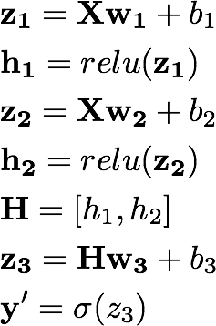
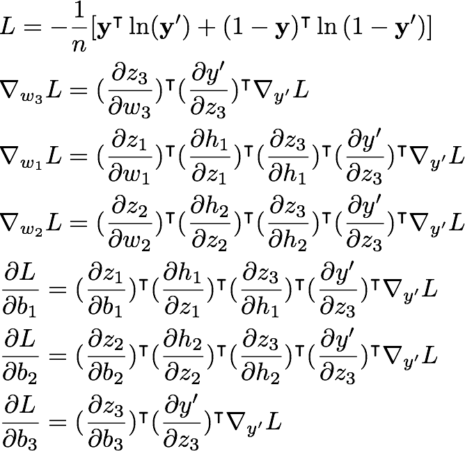
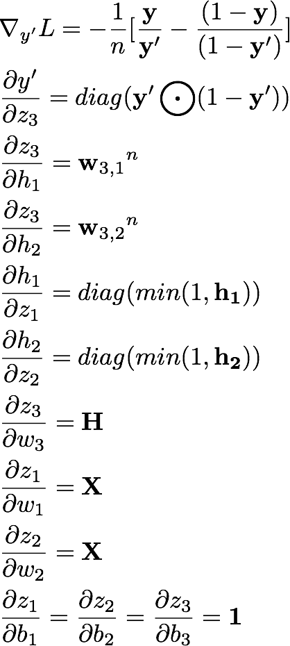
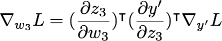

# Gradient Descent with Backpropagation
This is a detailed example of learning XOR problem using a minimal neural network trained by GD and BP

## Neural Network Model

### Input
Dimension: 2
### Hidden Layer
**Dimension:** 2

**Activation Function:** ReLU
### Output
**Dimension:** 1

**Activation Function:** Sigmoid
### Loss
Cross Entropy
### Optimization
Gradient Descent

## Forward Calculation

## Grad Calculation

## Individual Grad

## Chain rule for vector case

A case like the previous one is calculated by the chain rule applied in reverse. As we want the result to be a column vector so we, effictively, transpose the gradient term, even if it is not explicitly annotated. Now, as the gradient is transposed, then the whole calculation needs to be transposed. The standard form of Jacobian is that the nominator is expanded in columns and denominator in rows. Now as the reverse is true for the transposed gradient, we need to transpose all the Jacobians, and reversing them of course, so that nominators and denominators are matched as the original chain rule.